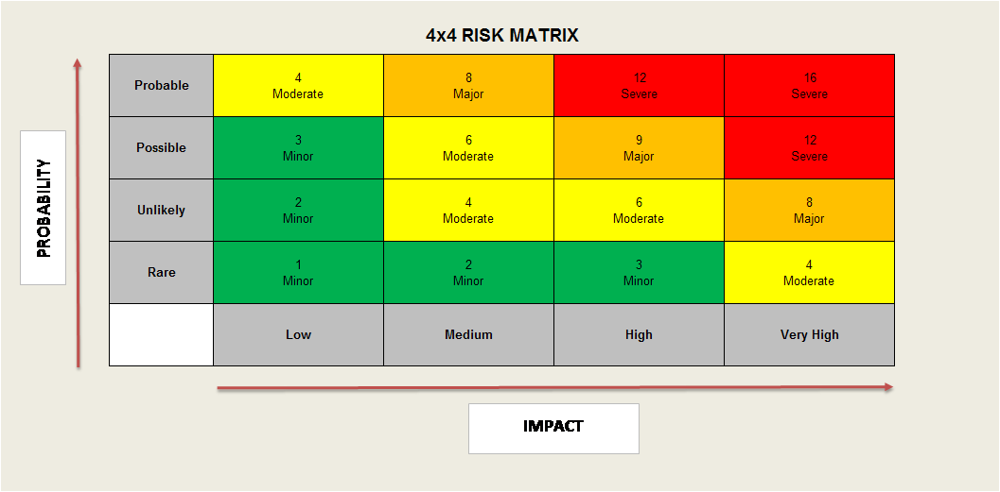

---
title: "Fallstudie Minicase"
author: [Florian Bär]
date: "HS18"
subject: "Information Security Fundamentals"
keywords: [Information Security, ISF, HSLU]
subtitle: "Information Security Fundamentals"
documentclass: scrartcl
titlepage: true
titlepage-color: "06386e"
titlepage-text-color: "FFFFFF"
titlepage-rule-color: "FFFFFF"
titlepage-rule-height: 3
...
\newpage
# Einführung zum MiniCase
Die Familie Meier wohnt in einem dreistöckigen Haus im zweiten Stockwerk. Insgesamt teilen 6 Wohnungen das Haus
auf. Eine fortschrittliche Familie aus dem Mittelstand mit bester Reputation. Für diese Familie sollte einen Massnahmenplan für allfällige Risiken gemäss der Aufgabenstellung \"Fallstudie: Die Heim PC Lösung\" erstellt werden.

Für die Eintrittswahrscheinlichkeit und der potenzielle Schaden (Schadensausmass) der Ereignisse wird eine Skala von 1 (sehr kleine(r) Wahrscheinlichkeit/Schaden) bis 4 (sehr grosse(r) Wahrscheinlichkeit/Schaden) verwendet.

## Risikomatrix
Mit der folgenden Risikomatrix wird das Risiko der jeweiligen Punkte bewertet:

\newpage

# Fallstudie ISF

## Was könnte schiefgehen?

Es folgt eine Liste mit Dingen, welche schiefgehen können:

1. Das Wireless brauch WEP. WEP ist veraltet und nicht sicher. Es ist ein upgrade zu WPA2 empfohlen.
    - Eintrittswahrscheinlichkeit: 4 - Da WEP schon veraltet ist und in wenigen Sekunden mit einem mittelklassigen Computer geknackt werden kann ist die Eintrittswahrscheinlichkeit hoch.
    - Schaden: 4 - Mit Zugriff auf das Netzwerk ist dem "Hacker" alles Möglich (Zugriff auf Computer, Kameras etc.).
    - RISIKO - Extrem (16)
1. Die Spiele und Tools, welche Onkel Özutück mitbringt, könnten gecrackt sein. Cracks beinhalten ein Sicherheitsrisiko. Selbst wenn Sie nicht gefährlich sind, dann sind diese illegal verwendet. 
    - Eintrittswahrscheinlichkeit: 4 - Sehr hoch, da im Text steht, dass der Onkel Özukück gratis Software mitbringt.
    - Schaden: 4 - Da Cracks häufig infiziert sind, ist das Risiko für das infizieren mit einer Schadsoftware sehr gross.
    - RISIKO - Extrem (16)
1. Da Jan ein Computerfreak ist, versucht er bestimmt immer neue Dinge. Dabei wird das Sicherheitsrisiko von diesen "Nerd"-Tools oftmals unterschätzt.
    - Eintrittswahrscheinlichkeit: 3 - Es gibt auch auf Github und anderen Clouddiensten viele Schadsoftware, welche als kleine Tools getarnt sind.
    - Schaden: 4 - Wenn der PC mit Schadsoftware infiziert wurde, dann ist dieser Computer dieser ausgeliefert.
    - RISIKO - Hoch (12)
1. Dora ist mit 12 Jahren ein junges Kind. Vor allem bei jungen Kindern sollte der Internetkonsum  kontrolliert werden. Dazu gibt es passende Kinderschutzsoftware.
    - Eintrittswahrscheinlichkeit: 4 - Da Kinder tendenziell sich am PC explorativ verhalten, kann Dora einfach auf zwilichtige Webseiten gelangen.
    - Schaden: 4 - Unter Umständen
    - RISIKO - Extrem (16)
1. Die Computer müssten auf einem NAS oder einem sonstigen Server ein Backup haben. Falls einmal eine HD kaputt gehen sollte, müssen die Daten wiederherstellbar sein.
    - Eintrittswahrscheinlichkeit: 3
    - Schaden: 3
    - RISIKO - Hoch (9)
1. Die Kameras könnten von einem Billighersteller sein, welcher die Sicherheitsysteme des Systems nicht sehr verantwortungsvoll implementiert. Diese könnten dann "gehackt" werden und einen grossen Eingriff in die Privatsphäre der Familie.
    - Eintrittswahrscheinlichkeit: 2
    - Schaden: 3
    - RISIKO - Mittel (6)
1. Der Desktop PC der Eltern sollte nicht gleichzeitig als PC und als Printserver verwendet werden. Server öffnen normalerweise Ports und Services für das Netzwerk und können so ein Sicherheitsrisiko darstellen.
    - Eintrittswahrscheinlichkeit: 2 - Games und Server öffnen Services für die Multiplayerfähigkeit. Diese stellen potenziell ein Sicherheitsrisiko dar.
    - Schaden: 3 - 
    - RISIKO - Mittel (6)
1. Windows Betriebssysteme besitzen zwar den Bitlocker, jedoch ist dieser Standardmässig nicht eingeschaltet und kann auch nur von forgeschrittenen Usern bedient werden. Dadurch sind die Daten auf den Disks nicht verschlüsselt und können unter Umständen ausgelesen werden.
    - Eintrittswahrscheinlichkeit: 2
    - Schaden: 3
    - RISIKO - Hoch (6)
1. Bei einem Brand wären alle Computer zerstört und es könnten keine Daten wiederhergestellt werden. 
    - Eintrittswahrscheinlichkeit: 2
    - Schaden: 4
    - RISIKO - Mittel (8)
1. Benutzen die Kinder und die Eltern die selbe Mail? Dies könnte allenfalls auch zu einem Risiko werden. Nicht alle Mails sind für die Augen der Kinder gedacht.
    - Eintrittswahrscheinlichkeit: 3
    - Schaden: 2
    - RISIKO - Mittel (6)

## Massnahmenplan

1. WEP mit WPA2 ersetzen
    - Auf dem Router anstelle von WEP ein WPA2 Passwort setzen. WPA2 ist viel schwerer zu intercepten und somit besteht ein geringers Risiko von einem unerwünschten Zugriff.
    - Eintrittswahrscheinlichkeit: 1
    - Schaden: 2
1. Teuererer Router mit Guest-Netz Funktion kaufen (z.B. Router ASUS RT-AC88U)
    - Somit ist es Gästen der Familie Meier nicht mehr möglich auf die selben Home-Resourcen zuzugreifen.
    - Eintrittswahrscheinlichkeit: 2
    - Schaden: 1
1. Arbeits-PC von Spiele PC trennen. 
    - Spiele können ungewollt Ports eines Systemes öffnen und damit ein Risiko darstellen. Zudem könne Mods (von Sohn Jan installiert) Sicherheitslücken beinhalten und ein Problem darstellen. Nach dieser Trennung sind grössere Lücken beim Arbeits-PC geschlossen.
    - Eintrittswahrscheinlichkeit: 2
    - Schaden: 2
1. Dora nur ein Laptop mit "Kindersicherung" geben. Dazu Dora keine Administratorenrechte geben. Diese Rechte reichen dem Kind.
    - Dora kann nun keine unerwünschte Software mehr installieren und von Ihr geht somit keine Gefahr mehr aus.
    - Eintrittswahrscheinlichkeit: 1
    - Schaden: 2
1. NAS kaufen, um ein Backup von Daten zu machen. Dieses NAS könnte auch mittels Docker einen PrinterServer hosten, was auch das Problem der geöffneten Ports des Arbeits-PCs löst.
    - Daten sind nun Zentral gesichert. Bei einem allfälligen Hardware-Defekt sind die Daten nicht verloren.
    - \+ Option auf Google Business-Account um Backup verschlüsselt auf die Cloud zu synchronisieren
    - Eintrittswahrscheinlichkeit: 1
    - Schaden: 3
1. Einen zweiten Router kaufen, um die Sensoren und Kameras in ein anderes Netz zu stellen. 
    - Durch diese Netztrennung, ist das Heimnetz von allfälligen Hackerangriffen besser geschützt.
    - Eintrittswahrscheinlichkeit: 1
    - Schaden: 3
1. Alle Computer mit Passwort sichern. Es sollten auf die Computer jeweils nur die Familienmitglieder Zugriff haben, welche dazu auch befugt sind. 
    - Der Zugriff auf die Computer bei einem Diebstahl ist erschwert und die Daten auf diesen Computern sind besser geschützt.
    - Eintrittswahrscheinlichkeit: 1
    - Schaden: 1
1. Software von Onkel Özutück sollte über den offiziellen Weg gekauft werden. 
    - Die installierte Software ist sicher legal gekauft und hat mit einer grossen Wahrscheinlichkeit keine grossen Sicherheitsrisiken. 
    - In betracht ziehen, dass Onkel Özutück in Zukunft die Computer nicht mehr verwalten sollte.
    - Eintrittswahrscheinlichkeit: 2
    - Schaden: 1
1. Für die Arbeiten, welche Herr Meier zu Hause macht sollte ein Arbeits-PC mit nach Hause genommen werden können. Diese sind in der Regel von der zuständigen IT-Abteilung genügen sicher "gehardened".
    - Die Familie muss sich nicht um die Sicherheit der Arbeitsdaten von Herrn Meier kümmern.
    - Eintrittswahrscheinlichkeit: 0
    - Schaden: 1
1. Auch auf Smartphones und Tablets Antivirenprogramme installieren. Auch wenn diese noch nicht sehr verbreitet sind, besteht durch Schadsoftware an Handys bereits heute ein beträchtlicher Schaden.
    - AdWare und andere Schadsoftware wird auf dem Smartphone und Tablet erkannt. Somit sind nicht nur die Daten besser gschützt.
    - Eintrittswahrscheinlichkeit: 2
    - Schaden: 1

# Fazit

Mit dem Upgrade zu einem besseren Router und einem NAS für die Backuplösungen konnten die meisten Risiken entschärft werden. Mit kleineren weiteren Massnahmen wie zum Beispiel Aufteilung der Computer auf die verschiedenen Usergruppen und update auf die neusten Betriebssysteme und Antiviren ist die Familie bereits auf einem sehr guten Weg für eine sichere und erfolgreiche Zukunft.

Dieser Inhalt wurde eigenständig von Florian Bär (florian.baer@stud.hslu.ch) erstellt. 
